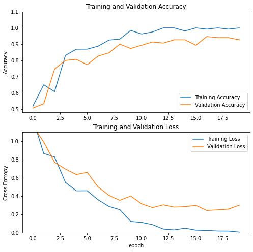
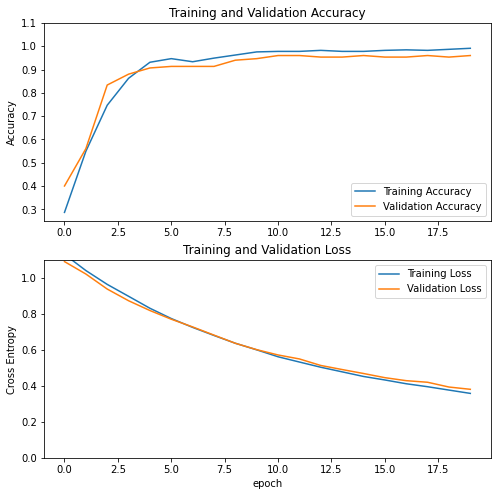

# Classifying Columbia University landmarks using neural networks

**by Jacqueline Araya**

In this notebook I use transfer learning to build a neural network model based on a well known CNN architecture, [VGG16](https://neurohive.io/en/popular-networks/vgg16/), that classifies with high accuracy any image of 3 popular Columbia University in the city of New York landmarks:


*   [Alma Mater](https://en.wikipedia.org/wiki/Alma_Mater_(New_York_sculpture)) 


*   [Scholars` Lion](http://www.wikicu.com/Scholar%27s_Lion)     


*  [The Curl in Uris Hall](https://blogs.cul.columbia.edu/outdoorsculpture/2015/12/22/meadmores-curl-conservation-complete/)


 


---


### Import Tensorflow 2.0 and other libraries


```
try:
  %tensorflow_version 2.x # enable TF 2.x in Colab
except Exception:
  pass
```

    `%tensorflow_version` only switches the major version: 1.x or 2.x.
    You set: `2.x # enable TF 2.x in Colab`. This will be interpreted as: `2.x`.
    
    
    TensorFlow 2.x selected.


```
import tensorflow as tf
print(tf.__version__)
```

    2.4.1


```
import IPython.display as display
import matplotlib.pyplot as plt
import numpy as np
import random
import time
import pathlib
import glob
import os, shutil
from PIL import Image, ExifTags
from keras.preprocessing.image import ImageDataGenerator

from tensorflow.keras import datasets, layers, models
```

### Some model specifications


```
AUTOTUNE = tf.data.experimental.AUTOTUNE
BATCH_SIZE = 32
IMG_SIZE = 256
SHUFFLE_SIZE = 1000
```

### Connect to Google Drive to download dataset of images and unzip to local folder


```
# Connect to Google Drive (to load raw data)
!pip install -U -q PyDrive
from pydrive.auth import GoogleAuth
from pydrive.drive import GoogleDrive
from google.colab import auth
from oauth2client.client import GoogleCredentials
# Authenticate and create the PyDrive client.
auth.authenticate_user()
gauth = GoogleAuth()
gauth.credentials = GoogleCredentials.get_application_default()
drive = GoogleDrive(gauth)
```


```
files_name = {'dataset_columbia.tar.gz': '1NAQ7MSbyAcMidMwLQfJ0pIYmhu161awF'}

for key, value in files_name.items():
  downloaded = drive.CreateFile({'id': value, 
                                'title': key})
  print("Downloading {} file ...".format(key))
  downloaded.GetContentFile(key)
```

    Downloading dataset_columbia.tar.gz file ...


```
#Untar locally Columbia Dataset
!pwd
!tar -zxf "dataset_columbia.tar.gz"
```

    /content


```
!rm -rf "dataset_columbia.tar.gz"
```


```
base_dir = "dataset_columbia/"
base_dir_path = pathlib.Path(base_dir)

photo_paths = list(base_dir_path.glob('*/*'))
photo_paths = [str(path) for path in photo_paths]
random.shuffle(photo_paths)

labels = list(base_dir_path.glob('*/'))
labels = [str(path).replace(base_dir,'') for path in labels]
```

Check the paths to images and the labels


```
photo_paths[:5]
```


    ['dataset_columbia/uris/20191004_183131_013.jpg',
     'dataset_columbia/uris/20191006_124543.jpg',
     'dataset_columbia/uris/20191004_170254.jpg',
     'dataset_columbia/uris/20191004_183103_003.jpg',
     'dataset_columbia/alma_matter/20191004_183459_031.jpg']


```
labels
```


    ['uris', 'alma_matter', 'lion']


How many images are there to train the model?


```
n_photos = len(photo_paths)
n_photos
```


    600


Let's display some images from the loaded files:


```
for n in range(3):
  image_path = random.choice(photo_paths)
  display.display(display.Image(image_path, width = 285, height = 275)) #resize images to display
  print()
```


    Output hidden; open in https://colab.research.google.com to view.


### Preprocessing raw images

The original photos (taken by me) are rotated internally because they were taken with a smartphone in a vertical way, therefore I'll use a function to change the original rotation of an image


```
def load_and_preprocess_image(path):
  '''
  Input: path of location of image
  Output: image modified and saved on same path, no return
  '''
  try:
    image=Image.open(path)
    for orientation in ExifTags.TAGS.keys():
        if ExifTags.TAGS[orientation]=='Orientation':
            break

    exif=dict(image._getexif().items())

    if exif[orientation] == 3:
        image=image.rotate(180, expand=True)
    elif exif[orientation] == 6:
        image=image.rotate(270, expand=True)
    elif exif[orientation] == 8:
        image=image.rotate(90, expand=True)

    image.save(path)
    image.close()
  except (AttributeError, KeyError, IndexError):
    # cases: image don't have getexif
    pass
```

Once the function is applied the jpg files are modified locally


```
result =  load_and_preprocess_image(photo_paths[2])
display.display(display.Image(photo_paths[2], width = 385, height = 375))
```


### Create a Train/Test split of the images paths

Create train and test splits using Sklearn library


```
#split train/test for processed images
from sklearn.model_selection import train_test_split
train_paths, test_paths = train_test_split(photo_paths)
```


```
len(train_paths), len(test_paths)
```


    (450, 150)


* Train images: 450 
* Test images: 150

Preprocess images and copy them to the Train or Test folder according to the Train/Test separation


```
#Create separate directories to get a train and a test dataset

#Split base_dir_path (images pahts) into train and test folders
train_dir = 'train'
if not os.path.exists(train_dir):
  os.mkdir(train_dir)

test_dir = 'test'
if not os.path.exists(test_dir):
  os.mkdir(test_dir)

for l in labels:
  train_label_dir = os.path.join(train_dir, l)
  if not os.path.exists(train_label_dir):
    os.mkdir(train_label_dir)
  test_label_dir = os.path.join(test_dir, l)
  if not os.path.exists(test_label_dir):
    os.mkdir(test_label_dir)
  
#Copy images to each corresponding folder while processing them
for p in train_paths:
  aux = os.path.basename(p)
  photo_label = p[len(base_dir):-(len(aux)+1)]
  dest = 'train/%s/%s'%(photo_label,aux)
  load_and_preprocess_image(p)
  shutil.copyfile(p, dest)

for p in test_paths:
  aux = os.path.basename(p)
  photo_label = p[len(base_dir):-(len(aux)+1)]
  dest = 'test/%s/%s'%(photo_label,aux)
  load_and_preprocess_image(p)
  shutil.copyfile(p, dest)

```


```
train_dir_path = pathlib.Path(train_dir)
test_dir_path = pathlib.Path(test_dir)
```

### Image generators

Use ImageDataGenerator from TF to create a generator that rescale images and create batches of images to feed to the model when training


```
train_datagen = ImageDataGenerator(rescale=1./255)
test_datagen = ImageDataGenerator(rescale=1./255)

train_generator = train_datagen.flow_from_directory(
        train_dir_path,
        target_size=(IMG_SIZE, IMG_SIZE),
        batch_size=32,
        shuffle=True,
        class_mode = "sparse")

test_generator = test_datagen.flow_from_directory(
        test_dir_path,
        target_size=(IMG_SIZE, IMG_SIZE),
        batch_size=32,
        class_mode = "sparse")

for data_batch, labels_batch in train_generator:
    print('data batch shape:', data_batch.shape)
    print('labels batch shape:', labels_batch.shape)
    break
    
for data_batch, labels_batch in test_generator:
    print('data batch shape:', data_batch.shape)
    print('labels batch shape:', labels_batch.shape)
    break
```

    Found 450 images belonging to 3 classes.
    Found 150 images belonging to 3 classes.
    data batch shape: (32, 256, 256, 3)
    labels batch shape: (32,)
    data batch shape: (32, 256, 256, 3)
    labels batch shape: (32,)


Check the generator works well with a batch of images


```
sample_training_images, sample_train_labels = next(train_generator)
```


```
sample_labels[:5]
```


    array([2., 1., 0., 0., 2.], dtype=float32)


```
train_generator.class_indices
inverse_class = {v:k for k, v in train_generator.class_indices.items()}
```


```
def plotImages(images_sample, labels_sample, class_dict):
    fig, axes = plt.subplots(1, 5, figsize=(20,20))
    axes = axes.flatten()
    for img, l, ax in zip(images_sample, labels_sample, axes):
        ax.imshow(img)
        ax.title.set_text(class_dict[int(l)])
        ax.axis('off')
    plt.tight_layout()
    plt.show()
```


```
plotImages(sample_training_images, sample_train_labels, inverse_class)
```


## Models


```
def plot_metrics(history):
  '''Function to plot accuracy and loss from train and test sets from model history once trained
  Input: model fit object
  Output: One plot for accuracy and one plot for loss
  '''
  acc = history.history['accuracy']
  val_acc = history.history['val_accuracy']

  loss = history.history['loss']
  val_loss = history.history['val_loss']

  plt.figure(figsize=(8, 8))
  plt.subplot(2, 1, 1)
  plt.plot(acc, label='Training Accuracy')
  plt.plot(val_acc, label='Validation Accuracy')
  plt.legend(loc='lower right')
  plt.ylabel('Accuracy')
  #plt.ylim([min(plt.ylim()),1.05])
  plt.title('Training and Validation Accuracy')

  plt.subplot(2, 1, 2)
  plt.plot(loss, label='Training Loss')
  plt.plot(val_loss, label='Validation Loss')
  plt.legend(loc='upper right')
  plt.ylabel('Cross Entropy')
  #plt.ylim([0,1.005])
  plt.title('Training and Validation Loss')
  plt.xlabel('epoch')
  plt.show()
```

### Simple CNN model

Let's create a small simple CNN model and see its performance


```
model_1 = models.Sequential()

model_1.add(layers.Conv2D(32, (3, 3), activation='relu', 
                        input_shape=(IMG_SIZE, IMG_SIZE, 3)))
model_1.add(layers.MaxPooling2D(pool_size=(2,2)))

model_1.add(layers.Conv2D(64, (3, 3), activation='relu', 
                        input_shape=(IMG_SIZE, IMG_SIZE, 3)))
model_1.add(layers.MaxPooling2D(pool_size=(2,2)))

model_1.add(layers.Flatten())
model_1.add(layers.Dense(3, activation='softmax'))

model_1.compile(optimizer='adam',
              loss='sparse_categorical_crossentropy',
              metrics=['accuracy'])
```


```
model_1.summary()
```

    Model: "sequential"
    _________________________________________________________________
    Layer (type)                 Output Shape              Param #   
    =================================================================
    conv2d (Conv2D)              (None, 254, 254, 32)      896       
    _________________________________________________________________
    max_pooling2d (MaxPooling2D) (None, 127, 127, 32)      0         
    _________________________________________________________________
    conv2d_1 (Conv2D)            (None, 125, 125, 64)      18496     
    _________________________________________________________________
    max_pooling2d_1 (MaxPooling2 (None, 62, 62, 64)        0         
    _________________________________________________________________
    flatten (Flatten)            (None, 246016)            0         
    _________________________________________________________________
    dense (Dense)                (None, 3)                 738051    
    =================================================================
    Total params: 757,443
    Trainable params: 757,443
    Non-trainable params: 0
    _________________________________________________________________


```
model_1_history = model_1.fit(
      train_generator,
      steps_per_epoch=5,
      epochs=20,
      validation_data=test_generator)
```

    Epoch 1/20
    5/5 [==============================] - 62s 13s/step - loss: 1.2471 - accuracy: 0.5188 - val_loss: 1.1691 - val_accuracy: 0.5067
    Epoch 2/20
    5/5 [==============================] - 56s 12s/step - loss: 0.8664 - accuracy: 0.6500 - val_loss: 0.9910 - val_accuracy: 0.5333
    Epoch 3/20
    5/5 [==============================] - 50s 12s/step - loss: 0.8283 - accuracy: 0.6077 - val_loss: 0.7699 - val_accuracy: 0.7467
    Epoch 4/20
    5/5 [==============================] - 51s 11s/step - loss: 0.5501 - accuracy: 0.8308 - val_loss: 0.6965 - val_accuracy: 0.8000
    Epoch 5/20
    5/5 [==============================] - 56s 12s/step - loss: 0.4572 - accuracy: 0.8687 - val_loss: 0.6364 - val_accuracy: 0.8067
    Epoch 6/20
    5/5 [==============================] - 50s 11s/step - loss: 0.4581 - accuracy: 0.8692 - val_loss: 0.6602 - val_accuracy: 0.7733
    Epoch 7/20
    5/5 [==============================] - 56s 12s/step - loss: 0.3600 - accuracy: 0.8875 - val_loss: 0.5002 - val_accuracy: 0.8267
    Epoch 8/20
    5/5 [==============================] - 55s 12s/step - loss: 0.2864 - accuracy: 0.9250 - val_loss: 0.4077 - val_accuracy: 0.8467
    Epoch 9/20
    5/5 [==============================] - 55s 12s/step - loss: 0.2513 - accuracy: 0.9312 - val_loss: 0.3534 - val_accuracy: 0.9000
    Epoch 10/20
    5/5 [==============================] - 54s 13s/step - loss: 0.1226 - accuracy: 0.9846 - val_loss: 0.4003 - val_accuracy: 0.8733
    Epoch 11/20
    5/5 [==============================] - 56s 12s/step - loss: 0.1120 - accuracy: 0.9625 - val_loss: 0.3153 - val_accuracy: 0.8933
    Epoch 12/20
    5/5 [==============================] - 55s 12s/step - loss: 0.0880 - accuracy: 0.9750 - val_loss: 0.2737 - val_accuracy: 0.9133
    Epoch 13/20
    5/5 [==============================] - 55s 12s/step - loss: 0.0393 - accuracy: 1.0000 - val_loss: 0.3040 - val_accuracy: 0.9067
    Epoch 14/20
    5/5 [==============================] - 55s 12s/step - loss: 0.0297 - accuracy: 1.0000 - val_loss: 0.2795 - val_accuracy: 0.9267
    Epoch 15/20
    5/5 [==============================] - 55s 12s/step - loss: 0.0489 - accuracy: 0.9812 - val_loss: 0.2842 - val_accuracy: 0.9267
    Epoch 16/20
    5/5 [==============================] - 51s 11s/step - loss: 0.0277 - accuracy: 1.0000 - val_loss: 0.2984 - val_accuracy: 0.8933
    Epoch 17/20
    5/5 [==============================] - 50s 10s/step - loss: 0.0245 - accuracy: 0.9923 - val_loss: 0.2420 - val_accuracy: 0.9467
    Epoch 18/20
    5/5 [==============================] - 56s 12s/step - loss: 0.0183 - accuracy: 1.0000 - val_loss: 0.2494 - val_accuracy: 0.9400
    Epoch 19/20
    5/5 [==============================] - 50s 11s/step - loss: 0.0177 - accuracy: 0.9923 - val_loss: 0.2572 - val_accuracy: 0.9400
    Epoch 20/20
    5/5 [==============================] - 52s 11s/step - loss: 0.0064 - accuracy: 1.0000 - val_loss: 0.3015 - val_accuracy: 0.9267


```
plot_metrics(model_1_history)
```





Once the model is trained we can make predictions (for simplicity I'll use the test dataset since we don't have a validation set)


The model returns probabilities of belonging to each class, I'll take the maximum to predict the class


```
class_testlabels = {v:k for k, v in test_generator.class_indices.items()}
```


```
sample_test_images, sample_test_labels = next(test_generator)
```


```
raw_prediction = model_1.predict(sample_test_images)
sample_prob_prediction = np.max(raw_prediction, axis=1)
sample_class_prediction = np.argmax(raw_prediction, axis=1)
```


```
#predictions for sample test
for r,c,p in zip(sample_test_labels[:10], sample_class_prediction[:10], sample_prob_prediction[:10]):
  print("Real label: %s -> Predicted label: %s with %s probability"%(class_testlabels[r],class_testlabels[c], np.round(p,3)))
```

    Real label: lion -> Predicted label: lion with 0.998 probability
    Real label: uris -> Predicted label: uris with 0.999 probability
    Real label: uris -> Predicted label: uris with 0.882 probability
    Real label: alma_matter -> Predicted label: alma_matter with 1.0 probability
    Real label: alma_matter -> Predicted label: alma_matter with 0.999 probability
    Real label: uris -> Predicted label: alma_matter with 0.772 probability
    Real label: alma_matter -> Predicted label: alma_matter with 0.999 probability
    Real label: lion -> Predicted label: lion with 0.999 probability
    Real label: lion -> Predicted label: lion with 1.0 probability
    Real label: alma_matter -> Predicted label: alma_matter with 0.997 probability


Can we do better?

### Transfer learning: VGG16 model

I'll use Keras applications module to load the well known VGG16 model. This allow us to use a far more complex archquitecture as the base of a model without the hassle of having to train it.

I'll use VGG16 model with weights from 'imagenet' and set the layers to not be trainable.


```
base_model = tf.keras.applications.VGG16(include_top=False, weights ='imagenet',
                                        input_shape = (IMG_SIZE, IMG_SIZE, 3))
base_model.trainable = False 
```

    Downloading data from https://storage.googleapis.com/tensorflow/keras-applications/vgg16/vgg16_weights_tf_dim_ordering_tf_kernels_notop.h5
    58892288/58889256 [==============================] - 1s 0us/step


Add two top layers to the base model of VGG16 to average last layer and predict:


```
global_average_layer = tf.keras.layers.GlobalAveragePooling2D()
prediction_layer = tf.keras.layers.Dense(3, activation='softmax')
```


```
# build a new model reusing the pretrained base
tl_model = tf.keras.Sequential([
  base_model,
  global_average_layer,
  prediction_layer])
```


```
tl_model.summary()
```

    Model: "sequential_1"
    _________________________________________________________________
    Layer (type)                 Output Shape              Param #   
    =================================================================
    vgg16 (Functional)           (None, 8, 8, 512)         14714688  
    _________________________________________________________________
    global_average_pooling2d (Gl (None, 512)               0         
    _________________________________________________________________
    dense_1 (Dense)              (None, 3)                 1539      
    =================================================================
    Total params: 14,716,227
    Trainable params: 1,539
    Non-trainable params: 14,714,688
    _________________________________________________________________


From the model summary, we can actually see that the number of parameters that are going to be trained is actually very small. This makes the online deployment of the model on a website to be much more lighter.

Compile and train:


```
tl_model.compile(optimizer=tf.keras.optimizers.Adam(learning_rate=0.001),
              loss='sparse_categorical_crossentropy',
              metrics=['accuracy'])
```


```
history = tl_model.fit(
      train_generator,
      epochs=20,
      validation_data=test_generator)
```

    Epoch 1/20
    15/15 [==============================] - 467s 33s/step - loss: 1.1784 - accuracy: 0.2538 - val_loss: 1.0918 - val_accuracy: 0.4000
    Epoch 2/20
    15/15 [==============================] - 457s 31s/step - loss: 1.0578 - accuracy: 0.4803 - val_loss: 1.0228 - val_accuracy: 0.5600
    Epoch 3/20
    15/15 [==============================] - 457s 31s/step - loss: 0.9812 - accuracy: 0.6893 - val_loss: 0.9391 - val_accuracy: 0.8333
    Epoch 4/20
    15/15 [==============================] - 456s 31s/step - loss: 0.9133 - accuracy: 0.8646 - val_loss: 0.8740 - val_accuracy: 0.8800
    Epoch 5/20
    15/15 [==============================] - 455s 31s/step - loss: 0.8588 - accuracy: 0.9097 - val_loss: 0.8195 - val_accuracy: 0.9067
    Epoch 6/20
    15/15 [==============================] - 461s 31s/step - loss: 0.7877 - accuracy: 0.9555 - val_loss: 0.7711 - val_accuracy: 0.9133
    Epoch 7/20
    15/15 [==============================] - 457s 31s/step - loss: 0.7368 - accuracy: 0.9257 - val_loss: 0.7283 - val_accuracy: 0.9133
    Epoch 8/20
    15/15 [==============================] - 457s 31s/step - loss: 0.6867 - accuracy: 0.9530 - val_loss: 0.6827 - val_accuracy: 0.9133
    Epoch 9/20
    15/15 [==============================] - 460s 31s/step - loss: 0.6576 - accuracy: 0.9500 - val_loss: 0.6372 - val_accuracy: 0.9400
    Epoch 10/20
    15/15 [==============================] - 458s 31s/step - loss: 0.6150 - accuracy: 0.9813 - val_loss: 0.6017 - val_accuracy: 0.9467
    Epoch 11/20
    15/15 [==============================] - 460s 31s/step - loss: 0.5691 - accuracy: 0.9796 - val_loss: 0.5722 - val_accuracy: 0.9600
    Epoch 12/20
    15/15 [==============================] - 459s 31s/step - loss: 0.5327 - accuracy: 0.9778 - val_loss: 0.5501 - val_accuracy: 0.9600
    Epoch 13/20
    15/15 [==============================] - 457s 31s/step - loss: 0.5183 - accuracy: 0.9841 - val_loss: 0.5138 - val_accuracy: 0.9533
    Epoch 14/20
    15/15 [==============================] - 455s 30s/step - loss: 0.5042 - accuracy: 0.9758 - val_loss: 0.4911 - val_accuracy: 0.9533
    Epoch 15/20
    15/15 [==============================] - 455s 32s/step - loss: 0.4698 - accuracy: 0.9781 - val_loss: 0.4691 - val_accuracy: 0.9600
    Epoch 16/20
    15/15 [==============================] - 454s 30s/step - loss: 0.4298 - accuracy: 0.9836 - val_loss: 0.4459 - val_accuracy: 0.9533
    Epoch 17/20
    15/15 [==============================] - 454s 30s/step - loss: 0.4059 - accuracy: 0.9860 - val_loss: 0.4292 - val_accuracy: 0.9533
    Epoch 18/20
    15/15 [==============================] - 455s 30s/step - loss: 0.3917 - accuracy: 0.9920 - val_loss: 0.4204 - val_accuracy: 0.9600
    Epoch 19/20
    15/15 [==============================] - 458s 31s/step - loss: 0.3790 - accuracy: 0.9906 - val_loss: 0.3938 - val_accuracy: 0.9533
    Epoch 20/20
    15/15 [==============================] - 454s 30s/step - loss: 0.3572 - accuracy: 0.9933 - val_loss: 0.3812 - val_accuracy: 0.9600


We can see an improvement in terms of accuracy for the validation set: 96%. Let's visualize its metrics:


```
plot_metrics(history)
```





Can we still keep improving the model?

### Fine tune top layers of base model

We can actually train some of the layers of the base model: bottom layers capture more fundamental shapes and patterns of images, but top layers actually learn features more specific to the dataset in hand.


```
base_model.trainable = True
```


```
#how many layers are in the base model
print("Number of layers in the base model: ", len(base_model.layers))

# Fine-tune from this layer onwards
fine_tune_at = 17

# Freeze all the layers before the `fine_tune_at` layer
for layer in base_model.layers[:fine_tune_at]:
  layer.trainable =  False
```

    Number of layers in the base model:  19


Out of the 19 layers of VGG16, let's train the last 2 layers.


```
tl_model.compile(optimizer=tf.keras.optimizers.Adam(learning_rate=0.0001/10),
              loss='sparse_categorical_crossentropy',
              metrics=['accuracy'])
```


```
tl_model.summary()
```

    Model: "sequential_1"
    _________________________________________________________________
    Layer (type)                 Output Shape              Param #   
    =================================================================
    vgg16 (Functional)           (None, 8, 8, 512)         14714688  
    _________________________________________________________________
    global_average_pooling2d (Gl (None, 512)               0         
    _________________________________________________________________
    dense_1 (Dense)              (None, 3)                 1539      
    =================================================================
    Total params: 14,716,227
    Trainable params: 2,361,347
    Non-trainable params: 12,354,880
    _________________________________________________________________


From the summary of this new model, we can see that by training the last 2 top layers plus the last layers to predict, the model becomes bigger: from 1,539 to 4,721,155 trainable parameters. Let's train from the last epoch of the previous model:


```
history_2 = tl_model.fit(
      train_generator,
      epochs=20+20,
      initial_epoch =  history.epoch[-1],
      validation_data=test_generator)
```

    Epoch 20/40
    15/15 [==============================] - 469s 32s/step - loss: 0.3634 - accuracy: 0.9767 - val_loss: 0.3147 - val_accuracy: 0.9600
    Epoch 21/40
    15/15 [==============================] - 467s 32s/step - loss: 0.2713 - accuracy: 0.9957 - val_loss: 0.2575 - val_accuracy: 0.9600
    Epoch 22/40
    15/15 [==============================] - 467s 31s/step - loss: 0.2130 - accuracy: 0.9981 - val_loss: 0.2146 - val_accuracy: 0.9600
    Epoch 23/40
    15/15 [==============================] - 468s 31s/step - loss: 0.1776 - accuracy: 0.9864 - val_loss: 0.1868 - val_accuracy: 0.9600
    Epoch 24/40
    15/15 [==============================] - 465s 31s/step - loss: 0.1412 - accuracy: 0.9920 - val_loss: 0.1577 - val_accuracy: 0.9600
    Epoch 25/40
    15/15 [==============================] - 466s 31s/step - loss: 0.1118 - accuracy: 0.9975 - val_loss: 0.1361 - val_accuracy: 0.9600
    Epoch 26/40
    15/15 [==============================] - 465s 31s/step - loss: 0.0943 - accuracy: 0.9968 - val_loss: 0.1246 - val_accuracy: 0.9600
    Epoch 27/40
    15/15 [==============================] - 466s 31s/step - loss: 0.0833 - accuracy: 0.9996 - val_loss: 0.1073 - val_accuracy: 0.9733
    Epoch 28/40
    15/15 [==============================] - 464s 31s/step - loss: 0.0648 - accuracy: 0.9985 - val_loss: 0.0999 - val_accuracy: 0.9733
    Epoch 29/40
    15/15 [==============================] - 470s 32s/step - loss: 0.0627 - accuracy: 0.9978 - val_loss: 0.0909 - val_accuracy: 0.9733
    Epoch 30/40
    15/15 [==============================] - 464s 31s/step - loss: 0.0543 - accuracy: 0.9953 - val_loss: 0.0809 - val_accuracy: 0.9733
    Epoch 31/40
    15/15 [==============================] - 464s 31s/step - loss: 0.0470 - accuracy: 0.9996 - val_loss: 0.0762 - val_accuracy: 0.9733
    Epoch 32/40
    15/15 [==============================] - 464s 31s/step - loss: 0.0393 - accuracy: 1.0000 - val_loss: 0.0708 - val_accuracy: 0.9733
    Epoch 33/40
    15/15 [==============================] - 464s 31s/step - loss: 0.0339 - accuracy: 1.0000 - val_loss: 0.0663 - val_accuracy: 0.9800
    Epoch 34/40
    15/15 [==============================] - 464s 31s/step - loss: 0.0330 - accuracy: 0.9981 - val_loss: 0.0629 - val_accuracy: 0.9800
    Epoch 35/40
    15/15 [==============================] - 464s 31s/step - loss: 0.0314 - accuracy: 1.0000 - val_loss: 0.0579 - val_accuracy: 0.9800
    Epoch 36/40
    15/15 [==============================] - 463s 31s/step - loss: 0.0282 - accuracy: 1.0000 - val_loss: 0.0565 - val_accuracy: 0.9800
    Epoch 37/40
    15/15 [==============================] - 465s 31s/step - loss: 0.0254 - accuracy: 1.0000 - val_loss: 0.0557 - val_accuracy: 0.9800
    Epoch 38/40
    15/15 [==============================] - 463s 31s/step - loss: 0.0209 - accuracy: 1.0000 - val_loss: 0.0525 - val_accuracy: 0.9800
    Epoch 39/40
    15/15 [==============================] - 464s 31s/step - loss: 0.0191 - accuracy: 1.0000 - val_loss: 0.0488 - val_accuracy: 0.9800
    Epoch 40/40
    15/15 [==============================] - 464s 31s/step - loss: 0.0213 - accuracy: 1.0000 - val_loss: 0.0492 - val_accuracy: 0.9867


We can see that for this round of training, the accuracy of the test set improves and the train set actually reaches 100% of accuracy.


```
plot_metrics(history_2)
```


Here, we need to make a decision based on the trade off of accuracy (and overfitting) vs. size of the model. Since the improvement in accuracy is not significantly higher, let's keep the simpler VGG16 base model without trainable layers, having in mind this model would be lighter to load and deploy on a website.

### Save model to Keras h5 format


```
tl_model.save("/content/columbiamodel.h5")
```


```
auth.authenticate_user()
gauth = GoogleAuth()
gauth.credentials = GoogleCredentials.get_application_default()
drive = GoogleDrive(gauth)

file1 = drive.CreateFile({"title": 'columbiamodel.h5'})
file1.SetContentFile('/content/columbiamodel.h5')
file1.Upload()
```

### Convert Keras h5 model with js and download to google drive


```
!pip install -U tensorflowjs==1.2.6
```

    Collecting tensorflowjs==1.2.6
      Downloading https://files.pythonhosted.org/packages/e7/6a/b8da7692e9a289edbb83f4693ceb2c0be270ad30a5aee7438627e562ff95/tensorflowjs-1.2.6-py3-none-any.whl
    Collecting tensorflow-hub==0.5.0
    [?25l  Downloading https://files.pythonhosted.org/packages/b5/be/f18c352d84382d9c795a0f37eaf16d42ace7d161fbb0ad20bdcd5e550015/tensorflow_hub-0.5.0-py2.py3-none-any.whl (78kB)
         |████████████████████████████████| 81kB 6.7MB/s 
    [?25hCollecting tensorflow==1.14.0
    [?25l  Downloading https://files.pythonhosted.org/packages/de/f0/96fb2e0412ae9692dbf400e5b04432885f677ad6241c088ccc5fe7724d69/tensorflow-1.14.0-cp36-cp36m-manylinux1_x86_64.whl (109.2MB)
         |████████████████████████████████| 109.2MB 115kB/s 
    [?25hCollecting h5py==2.8.0
    [?25l  Downloading https://files.pythonhosted.org/packages/8e/cb/726134109e7bd71d98d1fcc717ffe051767aac42ede0e7326fd1787e5d64/h5py-2.8.0-cp36-cp36m-manylinux1_x86_64.whl (2.8MB)
         |████████████████████████████████| 2.8MB 59.7MB/s 
    [?25hCollecting numpy==1.16.4
    [?25l  Downloading https://files.pythonhosted.org/packages/87/2d/e4656149cbadd3a8a0369fcd1a9c7d61cc7b87b3903b85389c70c989a696/numpy-1.16.4-cp36-cp36m-manylinux1_x86_64.whl (17.3MB)
         |████████████████████████████████| 17.3MB 236kB/s 
    [?25hCollecting six==1.11.0
      Downloading https://files.pythonhosted.org/packages/67/4b/141a581104b1f6397bfa78ac9d43d8ad29a7ca43ea90a2d863fe3056e86a/six-1.11.0-py2.py3-none-any.whl
    Collecting keras==2.2.4
    [?25l  Downloading https://files.pythonhosted.org/packages/5e/10/aa32dad071ce52b5502266b5c659451cfd6ffcbf14e6c8c4f16c0ff5aaab/Keras-2.2.4-py2.py3-none-any.whl (312kB)
         |████████████████████████████████| 317kB 60.1MB/s 
    [?25hRequirement already satisfied, skipping upgrade: protobuf>=3.4.0 in /usr/local/lib/python3.6/dist-packages (from tensorflow-hub==0.5.0->tensorflowjs==1.2.6) (3.10.0)
    Requirement already satisfied, skipping upgrade: wrapt>=1.11.1 in /usr/local/lib/python3.6/dist-packages (from tensorflow==1.14.0->tensorflowjs==1.2.6) (1.12.1)
    Requirement already satisfied, skipping upgrade: keras-preprocessing>=1.0.5 in /usr/local/lib/python3.6/dist-packages (from tensorflow==1.14.0->tensorflowjs==1.2.6) (1.1.2)
    Requirement already satisfied, skipping upgrade: termcolor>=1.1.0 in /usr/local/lib/python3.6/dist-packages (from tensorflow==1.14.0->tensorflowjs==1.2.6) (1.1.0)
    Collecting tensorflow-estimator<1.15.0rc0,>=1.14.0rc0
    [?25l  Downloading https://files.pythonhosted.org/packages/3c/d5/21860a5b11caf0678fbc8319341b0ae21a07156911132e0e71bffed0510d/tensorflow_estimator-1.14.0-py2.py3-none-any.whl (488kB)
         |████████████████████████████████| 491kB 57.2MB/s 
    [?25hRequirement already satisfied, skipping upgrade: gast>=0.2.0 in /usr/local/lib/python3.6/dist-packages (from tensorflow==1.14.0->tensorflowjs==1.2.6) (0.3.3)
    Requirement already satisfied, skipping upgrade: keras-applications>=1.0.6 in /usr/local/lib/python3.6/dist-packages (from tensorflow==1.14.0->tensorflowjs==1.2.6) (1.0.8)
    Requirement already satisfied, skipping upgrade: astor>=0.6.0 in /usr/local/lib/python3.6/dist-packages (from tensorflow==1.14.0->tensorflowjs==1.2.6) (0.8.1)
    Collecting tensorboard<1.15.0,>=1.14.0
    [?25l  Downloading https://files.pythonhosted.org/packages/91/2d/2ed263449a078cd9c8a9ba50ebd50123adf1f8cfbea1492f9084169b89d9/tensorboard-1.14.0-py3-none-any.whl (3.1MB)
         |████████████████████████████████| 3.2MB 43.1MB/s 
    [?25hRequirement already satisfied, skipping upgrade: grpcio>=1.8.6 in /usr/local/lib/python3.6/dist-packages (from tensorflow==1.14.0->tensorflowjs==1.2.6) (1.29.0)
    Requirement already satisfied, skipping upgrade: google-pasta>=0.1.6 in /usr/local/lib/python3.6/dist-packages (from tensorflow==1.14.0->tensorflowjs==1.2.6) (0.2.0)
    Requirement already satisfied, skipping upgrade: wheel>=0.26 in /usr/local/lib/python3.6/dist-packages (from tensorflow==1.14.0->tensorflowjs==1.2.6) (0.34.2)
    Requirement already satisfied, skipping upgrade: absl-py>=0.7.0 in /usr/local/lib/python3.6/dist-packages (from tensorflow==1.14.0->tensorflowjs==1.2.6) (0.9.0)
    Requirement already satisfied, skipping upgrade: pyyaml in /usr/local/lib/python3.6/dist-packages (from keras==2.2.4->tensorflowjs==1.2.6) (3.13)
    Requirement already satisfied, skipping upgrade: scipy>=0.14 in /usr/local/lib/python3.6/dist-packages (from keras==2.2.4->tensorflowjs==1.2.6) (1.4.1)
    Requirement already satisfied, skipping upgrade: setuptools in /usr/local/lib/python3.6/dist-packages (from protobuf>=3.4.0->tensorflow-hub==0.5.0->tensorflowjs==1.2.6) (47.1.1)
    Requirement already satisfied, skipping upgrade: werkzeug>=0.11.15 in /usr/local/lib/python3.6/dist-packages (from tensorboard<1.15.0,>=1.14.0->tensorflow==1.14.0->tensorflowjs==1.2.6) (1.0.1)
    Requirement already satisfied, skipping upgrade: markdown>=2.6.8 in /usr/local/lib/python3.6/dist-packages (from tensorboard<1.15.0,>=1.14.0->tensorflow==1.14.0->tensorflowjs==1.2.6) (3.2.2)
    Requirement already satisfied, skipping upgrade: importlib-metadata; python_version < "3.8" in /usr/local/lib/python3.6/dist-packages (from markdown>=2.6.8->tensorboard<1.15.0,>=1.14.0->tensorflow==1.14.0->tensorflowjs==1.2.6) (1.6.0)
    Requirement already satisfied, skipping upgrade: zipp>=0.5 in /usr/local/lib/python3.6/dist-packages (from importlib-metadata; python_version < "3.8"->markdown>=2.6.8->tensorboard<1.15.0,>=1.14.0->tensorflow==1.14.0->tensorflowjs==1.2.6) (3.1.0)
    ERROR: umap-learn 0.4.3 has requirement numpy>=1.17, but you'll have numpy 1.16.4 which is incompatible.
    ERROR: google-colab 1.0.0 has requirement six~=1.12.0, but you'll have six 1.11.0 which is incompatible.
    ERROR: datascience 0.10.6 has requirement folium==0.2.1, but you'll have folium 0.8.3 which is incompatible.
    ERROR: albumentations 0.1.12 has requirement imgaug<0.2.7,>=0.2.5, but you'll have imgaug 0.2.9 which is incompatible.
    Installing collected packages: six, numpy, tensorflow-hub, tensorflow-estimator, tensorboard, tensorflow, h5py, keras, tensorflowjs
      Found existing installation: six 1.12.0
        Uninstalling six-1.12.0:
          Successfully uninstalled six-1.12.0
      Found existing installation: numpy 1.18.4
        Uninstalling numpy-1.18.4:
          Successfully uninstalled numpy-1.18.4
      Found existing installation: tensorflow-hub 0.8.0
        Uninstalling tensorflow-hub-0.8.0:
          Successfully uninstalled tensorflow-hub-0.8.0
      Found existing installation: tensorflow-estimator 2.2.0
        Uninstalling tensorflow-estimator-2.2.0:
          Successfully uninstalled tensorflow-estimator-2.2.0
      Found existing installation: tensorboard 2.2.2
        Uninstalling tensorboard-2.2.2:
          Successfully uninstalled tensorboard-2.2.2
      Found existing installation: tensorflow 2.2.0
        Uninstalling tensorflow-2.2.0:
          Successfully uninstalled tensorflow-2.2.0
      Found existing installation: h5py 2.10.0
        Uninstalling h5py-2.10.0:
          Successfully uninstalled h5py-2.10.0
      Found existing installation: Keras 2.3.1
        Uninstalling Keras-2.3.1:
          Successfully uninstalled Keras-2.3.1
    Successfully installed h5py-2.8.0 keras-2.2.4 numpy-1.16.4 six-1.11.0 tensorboard-1.14.0 tensorflow-1.14.0 tensorflow-estimator-1.14.0 tensorflow-hub-0.5.0 tensorflowjs-1.2.6


```
!mkdir tfjs_model
```


```
!tensorflowjs_converter --input_format=keras \
/content/columbiamodel.h5 \
/content/tfjs_model
```


```
[f for f in os.listdir('/content/tfjs_model/')]
```


    ['group1-shard15of15.bin',
     'group1-shard6of15.bin',
     'group1-shard2of15.bin',
     'group1-shard3of15.bin',
     'group1-shard9of15.bin',
     'group1-shard11of15.bin',
     'group1-shard7of15.bin',
     'group1-shard14of15.bin',
     'group1-shard4of15.bin',
     'group1-shard1of15.bin',
     'group1-shard13of15.bin',
     'group1-shard10of15.bin',
     'group1-shard5of15.bin',
     'model.json',
     'group1-shard12of15.bin',
     'group1-shard8of15.bin']


```
auth.authenticate_user()
gauth = GoogleAuth()
gauth.credentials = GoogleCredentials.get_application_default()
drive = GoogleDrive(gauth)

bin_files = [f for f in os.listdir('/content/tfjs_model/')] #binfiles and model.json

for name in bin_files:
  #name = key + '.bin'
  uploaded = drive.CreateFile({'title': name})
  print("Uploading {} file ...".format(name))
  uploaded.SetContentFile('/content/tfjs_model/%s'%name)
  uploaded.Upload()
```

    Uploading group1-shard15of15.bin file ...
    Uploading group1-shard6of15.bin file ...
    Uploading group1-shard2of15.bin file ...
    Uploading group1-shard3of15.bin file ...
    Uploading group1-shard9of15.bin file ...
    Uploading group1-shard11of15.bin file ...
    Uploading group1-shard7of15.bin file ...
    Uploading group1-shard14of15.bin file ...
    Uploading group1-shard4of15.bin file ...
    Uploading group1-shard1of15.bin file ...
    Uploading group1-shard13of15.bin file ...
    Uploading group1-shard10of15.bin file ...
    Uploading group1-shard5of15.bin file ...
    Uploading model.json file ...
    Uploading group1-shard12of15.bin file ...
    Uploading group1-shard8of15.bin file ...


The bin files along with the model in json format are going to be use to deploy the classifier model on a simple website using TensorFlow.js

Visit: https://jacquelinearaya.github.io/classifier to see the model deployed.
